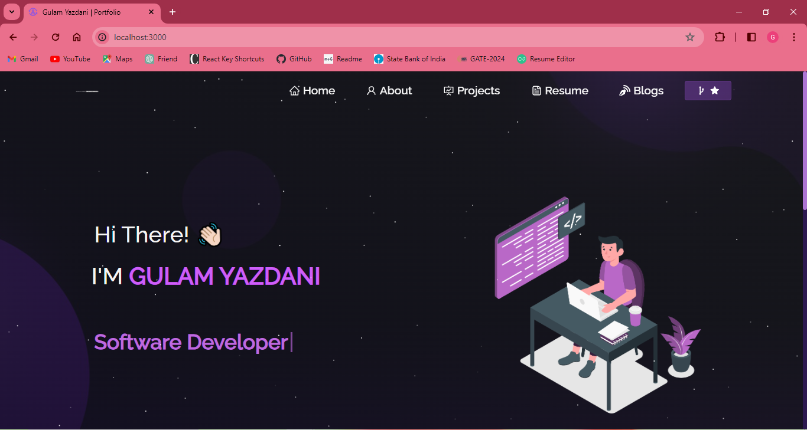

<h2 align="center">
  Portfolio Website - v2.0 
  <a href="https://gulamyazdaniportfolio.vercel.app/" target="_blank">Gulam Yazdani Portfolio</a>
</h2>
<h2 align="center">
  Snapshot of the Landing Page 
</h2>

  

 
<h3 align="center">
    🔹
    <a href="https://github.com/iamyazdani/portfolio/issues">Report Bug</a> &nbsp; &nbsp;
    🔹
    <a href="https://github.com/iamyazdani/portfolio/issues">Request Feature</a>
</h3>

## TL;DR

You can fork this repo to modify and make changes of your own. Please give me proper credit by linking back to [Gulam Yazdani](https://github.com/iamyazdani/portfolio). Thanks!

## Details about the project

My personal portfolio <a href="https://gulamyazdaniportfolio.vercel.app/" target="_blank">Gulam Yazdani Portfolio - v2.0</a> which features some of my github projects as well as my resume and technical skills. 
You can check version 1.0 here <a href="https://gulam-yazdani.netlify.app/" target="_blank">Gulam Yazdani Portfolio - v1.0</a>  
This project was built using these technologies:

- React.js
- Express.js
- Node.js
- CSS3
- VSCode
- Vercel

## Features

**📖 Multi-Page Layout**

**🎨 Styled with React-Bootstrap and CSS3 with easy to customize colors**

**📱 Fully Responsive**

## Getting Started

Clone down this repository. You will need `node.js` and `git` installed globally on your machine.
1. To check `Node.js` is installed on your computer, run command `node -v`
2. To check `git` is installed on your computer, run command `git -v`

## 🛠 Installation and Setup Instructions

1. Installation: `npm install`
2. In the project directory, you can run: `npm run start`

Runs the app in the development mode.\
Open [http://localhost:3000](http://localhost:3000) to view it in the browser.
The page will reload if you make edits.

## Usage Instructions

Open the project folder and Navigate to `/src/components/`.  
You will find all the components used and you can edit your information accordingly.

## Show your support

Give a ⭐ if you like this website! Thanks for your support.
